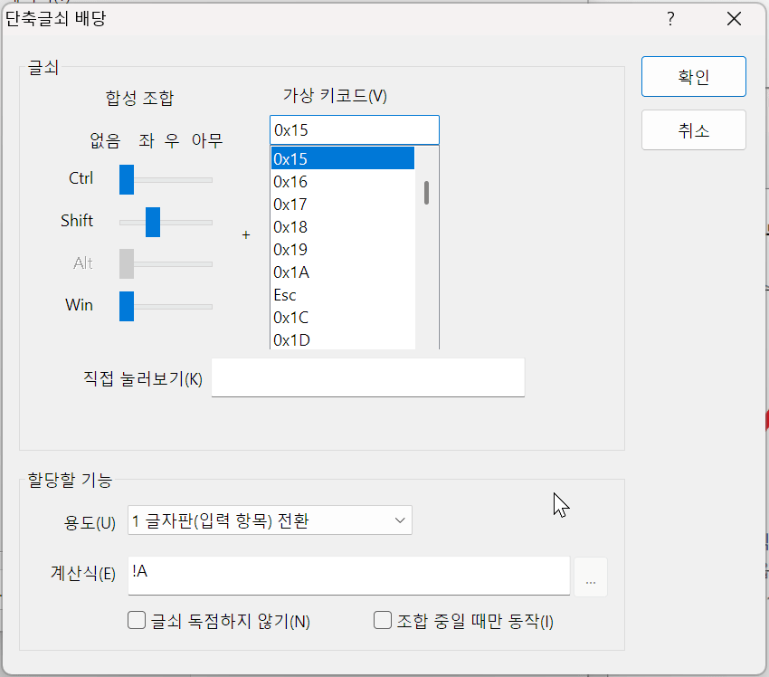

> 이미지 출처 - [익스트림 매뉴얼 (extrememanual.net)](https://extrememanual.net/37873)

Windows 10에서는 위 이미지와 같이 ㄱ을 두 번 눌러 ㄱㄱ을 ㄲ으로 치는 것과 같이 이중 자음/모음 입력에 관한 옵션이 있었는데, 그 외 버전에서는 [포럼 글과 같이](https://answers.microsoft.com/ko-kr/windows/forum/all/microsoft%EC%9E%85%EB%A0%A5%EA%B8%B0/d4c9d591-fae1-4cbe-95b9-bda46768be9e) 없어진 것으로 추정된다.

모바일 폰에서는 존재하는 단모음 키보드를 PC에서 사용해보고 싶어 약간의 조사를 거쳤는데, [날개셋 한글 입력기](http://moogi.new21.org/ngs_download.htm) 프로그램을 사용하여 비슷한 기능을 구현해볼 수 있겠다고 생각이 들었다.

날개셋 한글 입력기는 [김용묵 님](http://moogi.new21.org/)께서 제작하신 프로그램으로 최근 업데이트가 글 작성 당시 2024년 1월로, 최근까지도 업데이트되고 있는 입력기 프로그램이다.

## 설치

> [!NOTE]
> 날개셋 한글 입력기는 Windows에서만 사용할 수 있다.

[날개셋 한글 입력기 다운로드 페이지](http://moogi.new21.org/ngs_download.htm)에 접속하여 자신의 컴퓨터에 맞는 설치 파일을 내려받아 프로그램을 설치하여 준다.

필자는 외부 모듈 외 두 옵션을 제외한 후 설치하였다. 최소 파일만 설치하고 싶다면 이런 방식으로 진행하여도 괜찮다.

다음 옵션에서는 특별한 사항이 해당되지 않는다면 '최초 설치 상태로 되돌리기'를 선택하는 것을 추천한다.

## 설정 바꾸기

메모장 같은 아무 입력 창이나 켠 뒤 텍스트 커서를 클릭하면 작업 표시줄에 날개셋 아이콘이 표시될 것이다.

이 아이콘을 왼쪽 클릭하여 표시되는 메뉴 중 '날개셋 제어판'을 클릭하여 준다.

아래와 같은 제어판이 표시되어야 한다.

이 중 빨간 동그라미 표시 된 왼쪽 아래의 '가져오기' 버튼을 클릭한다.

[날개셋\_단모음.set](./assets/날개셋_단모음.set)

그 후 위 파일을 내려 받은 후 이 파일을 선택해 준다.

정상적으로 불러와졌다면 저런 식으로 두 개의 항목이 표시되어야 한다.

## 한영키 변경하기

한영키를 변경하려면 왼쪽 메뉴에서 '편집기 계층' > '단축글쇠'를 클릭한 뒤 사진에서 사각형으로 표시한 항목을 두 번 연속 클릭하여 편집 창에 들어가야 한다.

그 후 표시되는 창에서 위 이미지와 같이 '직접 눌러보기' 칸을 클릭한 후 원하는 키(필자의 경우 `Shift` + `Space`)를 차례대로 입력한 후 '확인' 버튼을 누르면 거의 모든 설정이 완료되었다.

그 후 자신이 입력한 키 조합이 정상적으로 등록되었는지 확인한 후 제어판의 '확인' 버튼을 눌러 제어판에서 빠져나온다.

## 입력기 변경하기

날개셋 입력기로 변경하려면 `Windows 키` + `Space` 조합을 눌러 선택하여 주면 된다.

