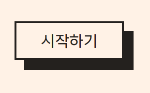
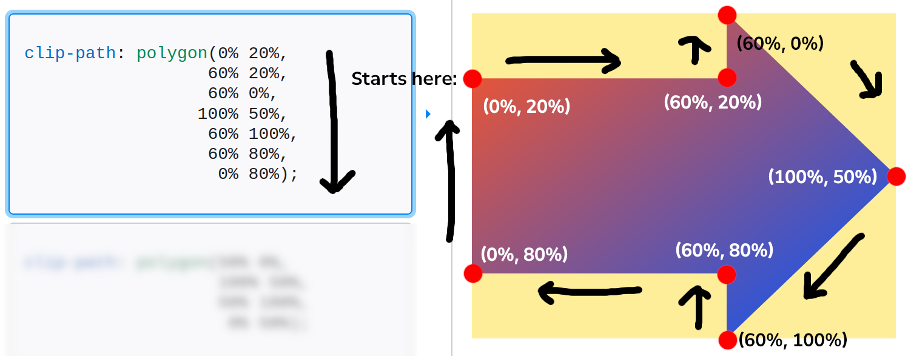
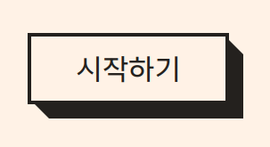
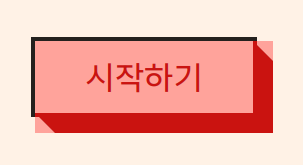
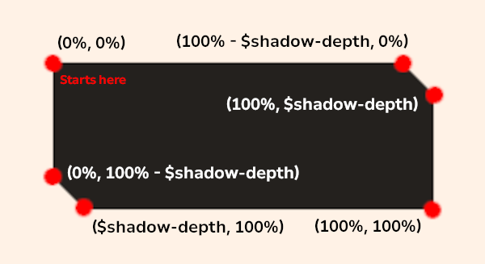
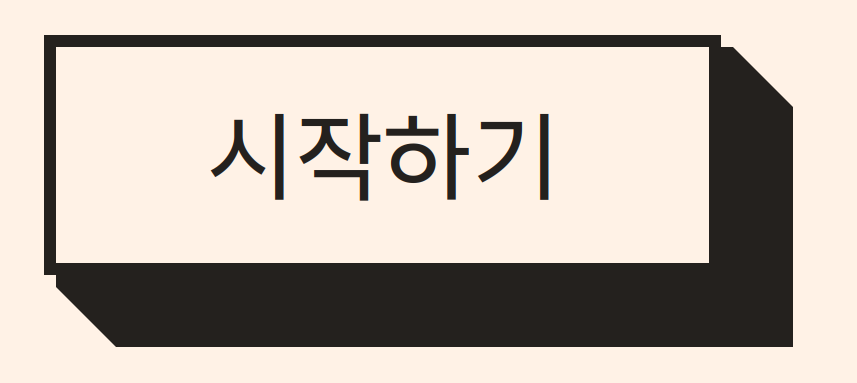

이 글에서는 위와 같은 그림자를 만들어 볼 예정이다.

## 기존의 그림자

새 프로젝트의 버튼을 디자인하기 위해 `box-shadow`를 사용해 플랫한 그림자를 구현하고자 하였다.



위와 같이 그림자가 정상적으로 적용되기는 하였는데, 그림자가 버튼과 동떨어져 있다는 느낌이 크게 들었다. 따라서 한때 유행이었던 Long Shadow를 적용하고자 하였고, 우선 검색을 통해 방법을 모색해보기로 하였다.

최종 결과물은 [마지막 문단에서 확인할 수 있다(클릭 시 이동).](#최종-결과물)

## 자료 탐색

Long Shadow를 CSS에서 구현하기 위해서 간단한 검색을 해보기로 하였다.

하지만 자료를 탐색하여 보니 공통적인 문제가 눈에 띄었는데, 모두 반복적인 `box-shadow`의 적용이나 추가적인 JavaScript 코드를 통하여 해당 그림자를 구현하고 있었던 것이다. 크게 성능 저하를 일으킬 수 있는 요인은 배제하고 싶었기에 다른 방법을 찾아보았다.

그러다 문득 `clip-path: polygon()` 문법을 사용하여 구현할 수 있지 않을까에 대한 생각이 들게 되었다.

## `clip-path`? `polygon()`?

`clip-path` 문법([MDN 문서 - clip-path](https://developer.mozilla.org/en-US/docs/Web/CSS/clip-path))은 간단히 말하자면 CSS를 통해 요소를 '가위처럼' 자를 수 있게 해주는 문법이다. 이떄 사용할 수 있는 모양은 아래와 같다.

- 원 모양의 `circle()`
- 타원 모양의 `ellipse()`
- 다각형 모양의 `polygon()`
- SVG path를 이용하는 `path()`
- 사각형 모양의 `rect()`
- x, y 좌표와 가로(w), 세로(h) 길이를 갖는 사각형을 이용하는 `xywh()`

여기서 그림자를 그리기 위해 `polygon()`을 이용하기로 하였다.

자세한 사용법은 [MDN 문서 - polygon()](https://developer.mozilla.org/en-US/docs/Web/CSS/basic-shape/polygon)를 참조하면 좋다.

`polygon()` 내 파라미터를 통해 다각형의 꼭짓점 좌표를 정하고, 그 다각형의 모양으로 모양이 나타나는 방식이다.



위 사진을 보면 이해가 편할 것이다. 각 파라미터들의 순서대로 꼭짓점 좌표들이 정해지고, 그 모양대로 모양이 잘리며 위 예시의 경우 화살표 모양이 나타난다. 시작점은 어디를 해도 무방하며, 마지막 꼭짓점에서 시작점으로 다시 돌아오지 않아도 된다.

또, 꼭짓점 좌표의 단위로 퍼센트 외에 일반적으로 사용하는 px 등과 같은 단위도 사용할 수 있으며, `calc()` 문법도 사용할 수 있다.

## `clip-path: polygon()`을 이용해서 Long Shadow 만들기

> [!info]
> 이 문서에서는 [SCSS](https://sass-lang.com/)를 이용한 구현을 설명한다.

완성된 코드는 아래와 같다.

```scss
button {
  --shadow-depth: 10px;

  position: relative; // 2.

  display: inline-block;

  padding: 8px 25px;

  font-weight: 500;
  font-size: 1rem;

  color: black;
  background-color: white;

  cursor: pointer;

  border: solid 2px currentColor;

  // 1.
  &::after {
    content: ''; // 1.

    position: absolute; // 2.
    z-index: -1; // 3.
    top: 0; // 4.
    left: 0; // 4.

    // 5.
    clip-path: polygon(
      0% 0%,
      calc(100% - var(--shadow-depth)) 0%,
      100% var(--shadow-depth),
      100% 100%,
      var(--shadow-depth) 100%,
      0% calc(100% - var(--shadow-depth))
    );

    background-color: currentColor;

    width: calc(100% + var(--shadow-depth)); // 4.
    height: calc(100% + var(--shadow-depth)); // 4.
  }
}
```



1.  우선, `clip-path`는 `box-shadow`에서 사용할 수 없으므로, `&::after`([MDN 문서 - ::after](https://developer.mozilla.org/en-US/docs/Web/CSS/::after))를 사용하여 그림자 역할을 할 새로운 요소를 만들었고, `content: ''`를 추가해 코드상에서 나타나도록 하였다.
2.  만든 새 그림자는 `absolute`의 위치를 가져야 하기 때문에, 원래 요소에 `relative` 위치를 추가한다.
3.  이렇게 되면, 원래 요소가 그림자에 의해 가려지기 때문에 `z-index`를 추가하여 그림자를 해당 요소 아래에 보이게 하였다.
4.  그림자는 원래 요소, 즉 버튼의 꼭짓점과 일치하게 나타나야 하므로 `top`과 `left` 값을 모두 `0`으로 설정하였다.

    또한 그림자의 가로와 세로는 `(기존 버튼의 값) + (그림자의 길이)`가 되어야 하므로 `calc()` 문법을 이용해 이를 설정하였다. 이때 그림자의 길이는 `--shadow-depth`에 상수로써 정의하였다.

    따라서 다음과 같은 위치 관계가 형성되었다.

    

    위 사진에서 빨간색은 `&::after` 요소이다.

5.  **`polygon()` 문법을 이용해서 그림자의 모양이 나타나도록 잘랐다.** 아래 사진은 꼭짓점의 위치를 나타낸 사진이다.

    

## 윤곽선까지 그림자 영역에 추가하기

지금 만든 버튼에서 그림자는 윤곽선(border)을 기준으로 위치가 정해져 있는데, 그림자가 윤곽선과 이어지도록 하고 싶었다.

```scss
$border-width: 2px; // <--

button {
  --shadow-depth: 10px;

  position: relative;

  display: inline-block;

  padding: 8px 25px;

  font-weight: 500;
  font-size: 1rem;

  color: black;
  background-color: white;

  cursor: pointer;

  border: solid $border-width currentColor; // <--

  &::after {
    content: '';

    position: absolute;
    z-index: -1;
    top: -$border-width; // <--
    left: -$border-width; // <--

    box-sizing: content-box; // <--
    padding: $border-width; // <--

    // ...
  }
}
```

따라서 우선 윤곽선의 길이를 `$border-width`로 상수로써 정의하고, `&::after` 요소에 `box-sizing: context-box`([MDN 문서 - box-sizing](https://developer.mozilla.org/en-US/docs/Web/CSS/box-sizing))를 추가하여 버튼의 가로 및 세로 길이에서 윤곽선까지 고려하도록 설정하였다.



따라서 위와 같은 모양이 나타났는데, 자세히 보면 그림자의 위치가 윤곽선과 맞지 않는 모습을 볼 수 있다. 이는 위치(`top`과 `left`)는 윤곽선이 끝난 지점부터 측정했기 때문에 나타나는 현상이므로, `top`과 `left`에서 윤곽선 길이만큼을 빼서 그림자가 위치가 정상적으로 설정되도록 하였다.

## 그림자 길이 애니메이션 추가하기

그림자 길이를 마우스 호버나 클릭과 같은 이벤트에 따라 동적으로 조정하고 싶다면 `--shadow-depth` 값을 변경하여 주면 된다.

```scss
$border-width: 2px;

button {
  --shadow-depth: 10px;

  // ...

  &::after {
    // ...

    transition: all 0.5s; // <--
  }

  &:hover {
    // <--
    --shadow-depth: 0px;
  }
}
```

위와 같이 `&::after`에 적절한 Transition을 추가해주고, 원하는 대로 `--shadow-depth` 값을 변경하여 주면 된다.

## 최종 결과물


```scss
$border-width: 2px;

button {
  --shadow-depth: 10px;

  position: relative;

  display: inline-block;

  padding: 8px 25px;

  font-weight: 500;
  font-size: 1rem;

  color: black;
  background-color: white;

  cursor: pointer;

  border: solid $border-width currentColor;

  &::after {
    content: '';

    position: absolute;
    z-index: -1;
    top: -$border-width;
    left: -$border-width;

    box-sizing: content-box;
    padding: $border-width;

    clip-path: polygon(
      0% 0%,
      calc(100% - var(--shadow-depth)) 0%,
      100% var(--shadow-depth),
      100% 100%,
      var(--shadow-depth) 100%,
      0% calc(100% - var(--shadow-depth))
    );

    background-color: currentColor;

    width: calc(100% + var(--shadow-depth));
    height: calc(100% + var(--shadow-depth));

    transition: all 0.5s;
  }

  &:hover {
    --shadow-depth: 0px;
  }
}
```
